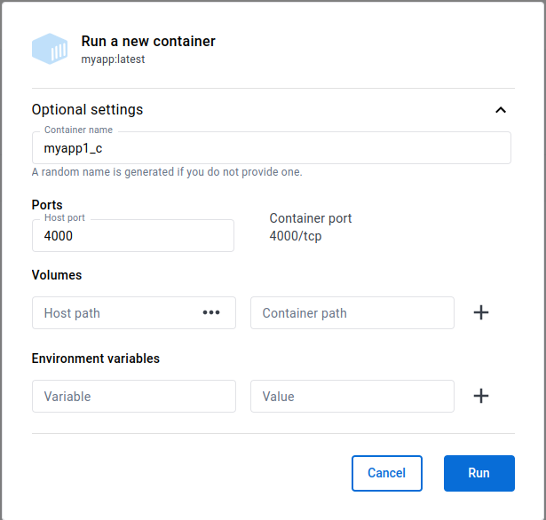

# Docker

Images are made up from several `layers`

| Image        |
| :---         |
| run commands |
| dependencies |
| source code  |
| parent image |

```Dockerfile
FROM node:16-alpine

# in image
WORKDIR /app

# first '.' is src relative to docker file
# second '.' is desition relative to workdir
COPY . .

RUN npm install

# port exposed by container
# relevant if spinner up containers via docker desktop
# docker desktop can use this for port mappings
EXPOSE 4000

CMD ["node", "app.js"]
```

# Build the Image

```sh
# -t tagname
# '.' is relative path to Dockerfile from command line current dir
docker build -t myapp .
```

We don't want to copy over the `node_modules` folder if there is one

Create a `.dockerignore` file

.dockerignore

```dockerignore
node_modules

*.md
```

## Images > Run

In the following - the port mapping is only shown as we included the `EXPOSE 4000` line in our Dockerfile



# Docker commands

List images

```sh
docker images
```

Run, specifying a `container name`

```sh
docker run --name myapp_c1 myapp
```

This isn't enough. If we try to hit `localhost:4000` it is unreachable.

We need to map the host port to the container port.

But we first need to stop the container.

# Show running containers

```sh
docker ps
```

Output
```
CONTAINER ID   IMAGE     COMMAND                  CREATED         STATUS         PORTS      NAMES
28a30c3963fa   myapp     "docker-entrypoint.s…"   2 minutes ago   Up 2 minutes   4000/tcp   myapp_c1
```

To stop the container, we provide either `the container id` or the `container name`

```sh
docker stop myapp_c1
```

Let's run it again, but this time we map a port on our computer to a port on the container

```sh
# -p is for publish
# port number on the left is for the host
# port number on the right is for the container

# -d will run in detached mode
docker run --name myapp_c2 -p 4000:4000 -d myapp
```

Now we can access it again via `localhost:4000`, and also the terminal is not blocked.

# Show all containers including stopped ones

```sh
docker ps -a
```

## docker run
Creates and runs a `new container`

## docker start
Starts and runs an `existing container`

```sh
docker start myapp_c2
```

# Code changes

Without volumes - if we make a change to the code, we need to rebuild the image.

# Layer caching

If we `build an Image`, docker `caches the layers`.

If we then `build another Image` which has the same initial layers as the first images. `Docker will pull those from the cache.`

